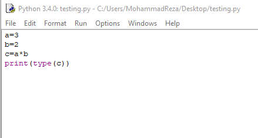

# Session 1 Exercises

## 1. Compare two numbers:

- الگوریتمی بنویسید که دو مقدار را از ورودی خوانده و مقدار بزرگتر را چاپ کند

### حالات مختلف مقایسه:

[×] A > B

[×] A < B

[×] A = B

### فارسی

1. عدد اول را بخوان و بعنوان A در نظر بگیر
2. عدد دوم را بخوان و بعنوان B در نظر بگیر
3. اگر A از B بزرگتر بود، آنگاه A را چاپ کن
4. **در غیر اینصورت اگر** B از A بزرگتر بود B را چاپ کن
5. **در غیر اینصورت اگر** A با B مساوی باشد. عبارت مساوی را چاپ کن
6. پایان

### English

1. read first number as A.
2. read second number as B.
3. if variable A greater than B: print A
4. **else if** variable B greater than A: print B
5. **else if** variable B equal than A: print equal
6. end

## 2. Read N Numbers and calculate sum.

- الگوریتمی بنویسید که تعداد N عدد را از ورودی خوانده و مجموع آنها را محاسبه و چاپ کند.

### Counting:

- counting 1 to N : N times
- counting 0 to N : N+1 times

### فارسی

1. N را در نظر بگیر
1. c را برابر صفر قرار بده
1. sum را برابر صفر قرار بده
   1. یک عدد از ورودی بخوان و در a بریز
   1. sum = sum + a
   1. c را یک واحد اضافه کن
   1. اگر c < N آنگاه برو به (1)
1. مقدار Sum را نمایش بده (چاپ کن)
1. پایان

### English

1. load N.
1. sum =0.
1. c=0.
   1. read number from input and assign it to a
   1. sum = sum + a
   1. c = c+ 1
   1. if c < N then go to (1)
1. print sum
1. end

- چون c را از صفر شروع کرده ایم برای اینکه به تعداد N بار فرایند تکرار شود و پس از آن خاتمه یابد، شرط c < N را گذاشتیم(یعنی وقتی c برابر N شود دیگر فرایند تکرار نمی‌شود). حال اگر c را برابر یک قرار داده و می‌خواستیم N بار فرایند تکرار شود، باید از شرط c <= N استفاده می‌کردیم

## 3. Read N Positive Numbers and determine which one is multiple of three.

- الگوریتمی بنویسید که تعداد N عدد صحیح و مثبت را خوانده و از بین آن‌ها تعداد اعدادی که بر 3 قابل قسمت هستند را مشخص نماید.

### How number a is multiple of b:

- if a divided by b remains zero, then a is multiple of b: 12/3=4 and remains 0
- counting 0 to N : N+1 times

### فارسی

1. N را در نظر بگیر
1. c را برابر صفر قرار بده
   1. یک عدد از ورودی بخوان و در a بریز
   1. اگر a % 3 مساوی صفر بود، آنگاه a را چاپ کن
   1. c را یک واحد اضافه کن
   1. اگر c < N آنگاه برو به (1)
1. پایان

### English

1. load N.
1. c=0.
   1. read number from input and assign it to a
   1. if a % 3 =0 then print a
   1. c = c+ 1
   1. if c < N then go to (1)
1. end

- عملگر % یا مد، باقیمانده حاصل تقسیم دو عدد را محاسبه می‌کند. حال اگر باقیمانده تقسیم a بر b برابر صفر باشد، یعنی a بر b بخش‌پذیر است.

## 4. Determine output of this code.

- خروجی عبارت زیر را مشخص کنید.

### فارسی

1. حاصل ضرب دو عدد صحیح، یک عدد صحیح می‌باشد.

## 5. Read number and determine its divisors.

- الگوریتمی بنویسید که یک عدد از ورودی بخواند و مقسوم علیه‌های آن را چاپ کند.

### Divisor:

- divisors of 12: 1,2,3,4,6,12
  - 12 % 1 = 0
  - 12 % 2 = 0
  - ...

### فارسی

1. a را از ورودی بخوان
1. c را برابر یک قرار بده
   1. اگر a % c مساوی صفر بود، آنگاه c را چاپ کن
   1. c را یک واحد اضافه کن
   1. اگر c <= a آنگاه برو به (1)
1. پایان

### English

1. read a.
1. c=1.
   1. if a % c =0 then print a
   1. c = c+ 1
   1. if c <= a then go to (1)
1. end

- در اینجا c را از یک شروع کرده ایم و تا خود a باید فرایند را تکرار کنیم تا تمام مقسوم علیه های آن چاپ شود.

